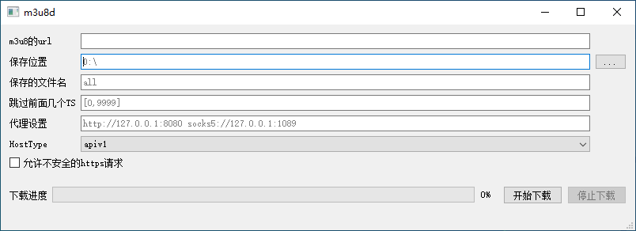

## m3u8d 一款m3u8下载工具
* 提供windows图形界面(Qt), mac\linux命令行 
* 可选使用ffmpeg转换格式为mp4
* windows界面(m3u8d_qt_v1.0_windows_amd64.exe):
    
* 下载: https://github.com/orestonce/m3u8d/releases    

## 实现说明
* download.go 大部分抄自 https://github.com/llychao/m3u8-downloader
* 将ffmpeg直接编译进windows的二进制了,如果在PATH里没有找到ffmpeg.exe
  又需要使用ffmpeg进行转码, 则自动将二进制里的ffmpeg解压到系统临时目录,然后使用.
  因此windows版本的可执行文件达到了32MB, 带Qt ui的可执行文件达到了惊人的 50MB
* linux/mac的二进制没有内置ffmpeg, 可执行文件小很多,约为 8.6MB
* 支持不使用ffmpeg合并,直接将ts文件拼接起来
* 支持跳过前面几个ts文件(一般是广告, 嘿嘿)
* 程序会在下载保存目录创建:
    * downloading/ 目录, 用于存放正在下载的分段ts视频, 按照m3u8的url进行划分
    * m3u8d_cache.cdb 文件, 用于存放以前的下载历史, 用于防止重复下载文件
* 重复下载文件的判定和跳过    
    * 将除了保存位置和保存文件名以外的参数进行hash, 得到文件下载id
    * 将文件下载id/文件大小/文件内容hash 储存在 m3u8_cache.cdb里面, 下载前搜索下载目录
    如果发现某个文件大小/文件内容hash和以前的记录相相等,则认为这个文件是以前下载的文件, 跳过
    此次下载.
## 二次开发操作手册:
    * 如果只开发命令行版本, 则只需要修改*.go文件, 然后编译 cmd/main.go 即可
    * 如果涉及到Qt界面打包, 则需要运行 export/main.go 将 *.go导出为Qt界面需要的
`m3u8-qt/m3u8.h`,`m3u8-qt/m3u8.cpp`, `m3u8-qt/m3u8-impl.a`. 然后使用QtCreator进行打包
## 发布协议
* m3u8-qt/ 目录采用 [GPL协议 v3](m3u8d-qt/LICENSE) 发布
* 除 m3u8-qt/ 以外的代码, 采用[MIT协议](LICENSE)发布 
